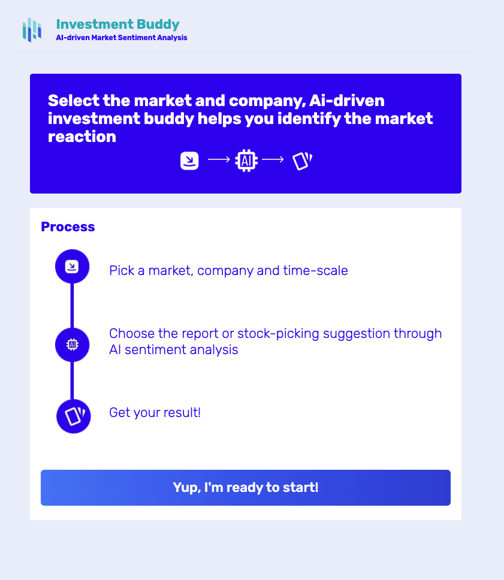
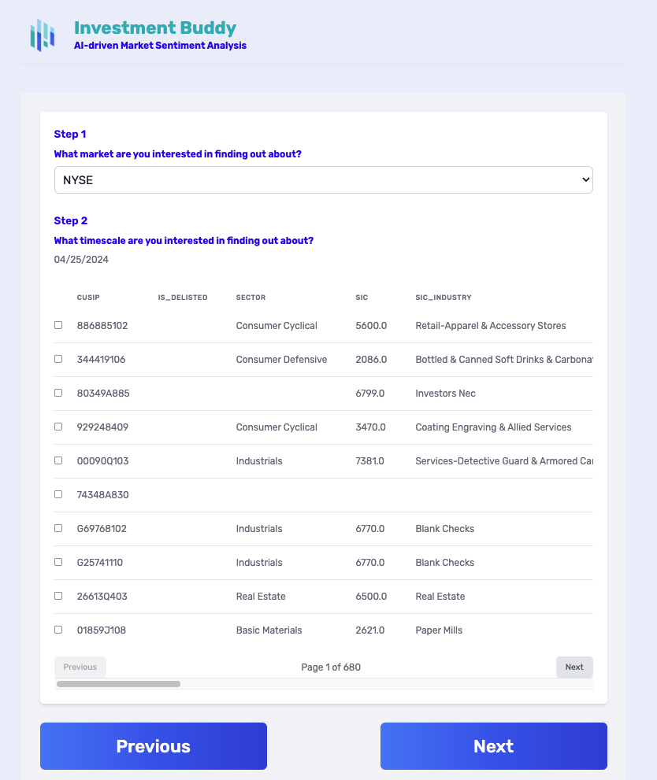

# Investment Buddy - Ai-driven Market Sentiment Analysis

## Getting Started

- First, run the development server `npm run dev`
- Open [http://localhost:3000](http://localhost:3000) with your browser to see the result.

## Functionality

## Sentiment Analysis the financial news retrieved from an API

- user is able to select Market and the Date

## Technology stack

- Next.js
- React.js
- Taiwind
- Hugging Faces Transformers Library (financial sentiment analysis and summarization)
- Fast API
- MySQL

## Backend repo

https://github.com/Invest-Insight-App/invest-insight-backend
